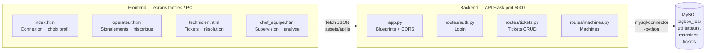
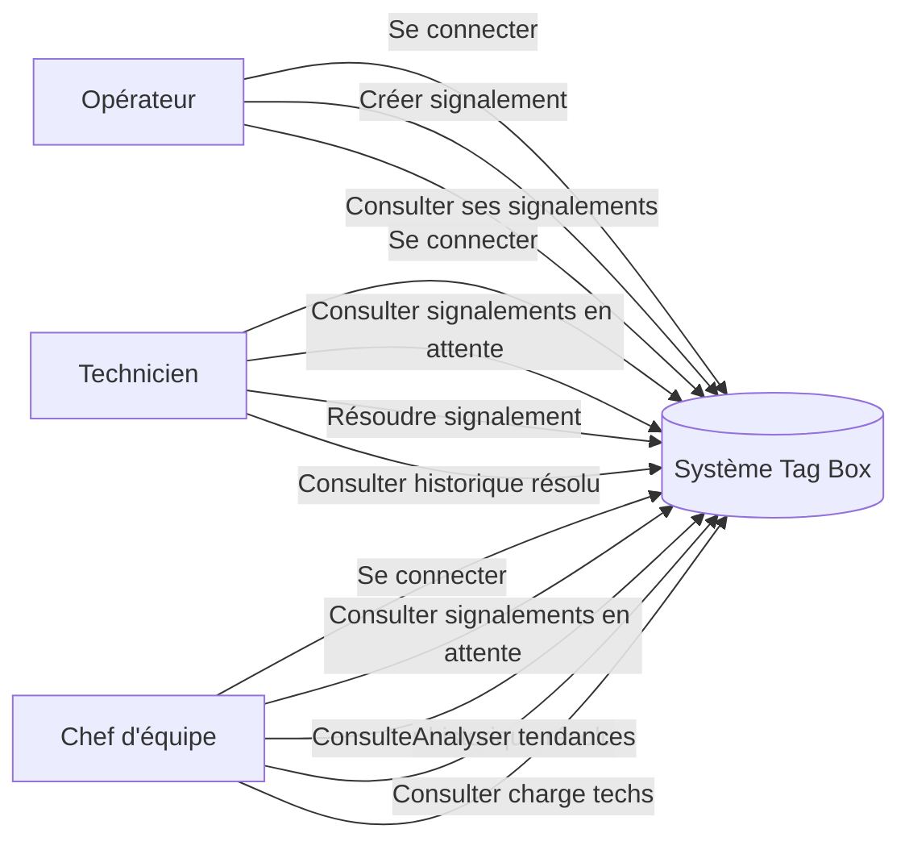

# Tag Box Lear — Numérisation TPM (Zone Cutting)

Application web de numérisation du système **Tag Box** de la zone Cutting de **Lear Corporation (Meknès)**, développée dans le cadre d'un stage TPM (certification Silver Level JIPM).

Le système Tag Box papier (étiquettes plastifiées écrites au marqueur) est remplacé par une interface web permettant :
- aux **opérateurs** de signaler une anomalie (Sécurité / Maintenance / Production) sur leur poste,
- aux **techniciens** de consulter ces signalements en temps réel, de les résoudre et de documenter l'action effectuée,
- aux **chefs d'équipe** de superviser tous les signalements en cours et l'historique résolu pour alimenter leur plan d'action.

L'interface est bilingue **français / arabe** avec support RTL complet.

> Le contexte complet du stage (objectifs, contraintes, planning) est détaillé dans [`RESUME_PROJET_TAG_BOX.txt`](RESUME_PROJET_TAG_BOX.txt).

---

## Architecture générale



- **Frontend** : pages HTML/CSS/JS statiques (pas de framework).
- **Backend** : API REST Flask avec blueprints, responses JSON.
- **Base de données** : MySQL (`tagbox_lear`), 3 tables interconnectées.

---

## Structure du projet

```
.
├── README.md                       # Ce fichier
├── RESUME_PROJET_TAG_BOX.txt       # Brief du stage
├── .gitignore                      # Exclut venv/, __pycache__, .env
│
├── database/
│   └── schema.sql                  # Schéma MySQL avec 3 tables
│
├── frontend/
│   ├── index.html                  # Connexion (2 étapes : profil + identifiants)
│   ├── operateur.html              # Créer un signalement + consulter l'historique
│   ├── technicien.html             # Gérer les signalements en cours et résolus
│   ├── chef_equipe.html            # Supervision et analyse (lecture seule)
│   └── assets/
│       ├── app.js                  # Session, traductions FR/AR, horloge, toasts
│       ├── api.js                  # Client fetch() pour communiquer avec le backend
│       ├── style.css               # Styles partagés (charte Lear, responsive, RTL)
│       ├── lear_corporation_logo.png  # Logo Lear (login et favicon)
│       └── lear_logo.png           # Logo Lear (topbar des pages)
│
└── backend/
    ├── app.py                      # Point d'entrée Flask
    ├── config.py                   # Configuration BD (env vars)
    ├── db.py                       # Connexion MySQL
    ├── seed.py                     # Données de test
    ├── requirements.txt            # Dépendances Python
    ├── .env.example                # Modèle .env
    └── routes/
        ├── auth.py                 # POST /api/auth/login
        ├── machines.py             # GET /api/machines
        └── tickets.py              # GET/POST/PATCH /api/tickets*
```

---

## Détail des fichiers

### `database/schema.sql`

Définit la base `tagbox_lear` avec 3 tables :

| Table | Rôle |
|-------|------|
| **`utilisateurs`** | Stocke matricule (PK), nom, `role` (enum), mot de passe. Rôles : `operateur`, `technicien`, `chef_equipe`. |
| **`machines`** | Machine (PK ex. `A01`, `B07`), zone (`A` ou `B`). Permet le dropdown lors de la création d'un signalement. |
| **`tickets`** | Un signalement complet : qui a signalé (matricule opérateur), sur quelle machine, quel type (sec/mai/pro), description, date/heure création, statut (ouvert/resolu), qui a résolu (matricule technicien), date/heure résolution, action effectuée. |

**Note** : `role` est entouré de backticks (`` `role` ``) car c'est un mot réservé MySQL 8.

---

### `frontend/index.html`

**Écran de connexion en deux étapes :**

1. **Sélection du profil** (3 boutons) :
   - **Opérateur** : Signaler une anomalie sur le poste.
   - **Technicien** : Consulter et résoudre les signalements.
   - **Chef d'équipe** : Superviser et analyser (lecture seule).

2. **Saisie des identifiants** :
   - Matricule (4-6 chiffres).
   - Mot de passe.

Bouton **bascule langue** (FR ↔ AR) en bas à gauche. Après connexion réussie, redirection vers la page du rôle.

---

### `frontend/assets/app.js`

**Module principal `TagBoxApp`** : session, langues, horloge, toasts.

**Fonctions publiques :**
- `setSession(user)` / `getSession()` / `clearSession()` — Gestion de sessionStorage.
- `requireSession(expectedRole)` — Vérifie la session et redirige si nécessaire.
- `homePage(role)` — Retourne l'URL de la page d'accueil selon le rôle.
- `logout()` — Efface la session et retour à index.html.
- `startClock(elementIds)` — Affiche l'heure en direct dans les éléments spécifiés.
- `showToast(message, type)` — Toast temporaire (succès ou erreur).
- `t(key)` — Traduction d'une clé (FR ou AR selon `getLang()`).

**Traductions** (dictionnaire `translations`) :
- ~250 clés couvrant toutes les labels, boutons, messages et erreurs.
- Clés bilingueset (FR/AR).

---

### `frontend/assets/api.js`

**Client `TagBoxAPI`** pour appels API Flask.

**Endpoints :**
- `login(matricule, password, role)` → `{ok, user}`.
- `getMachines()` → `{A: [...], B: [...]}`.
- `getTickets({statut, matricule, type})` → Array de tickets.
- `createTicket({matricule, machine, type, description, date, heure})` → `{ok}`.
- `resolveTicket(id, {matricule_technicien, action_effectuee})` → `{ok}`.
- `getStats()` → `{total, sec, mai, pro}`.

---

### `frontend/operateur.html`

**Interface opérateur** avec 2 onglets :

**Onglet 1 : Nouveau signalement**
- Formulaire de création :
  - Matricule (pré-rempli depuis la session).
  - Machine (dropdown par zone A/B).
  - Date/heure (date + horloge en temps réel).
  - Type d'anomalie (3 boutons : Sécurité, Maintenance, Production).
  - Description (textarea).
  - Validation et envoi via API.

**Onglet 2 : Mes signalements**
- Liste de tous les signalements de l'opérateur.
- **Date range picker** (deux champs date) avec défaut 7 jours en arrière.
- Affichage du statut (En cours / Résolu) pour chaque ticket.
- Lecture seule (pas d'action possible depuis cet onglet).

---

### `frontend/technicien.html`

**Tableau de bord technicien** avec 2 onglets + stats.

**Statistiques** (en haut) :
- Total ouverts, Sécurité, Maintenance, Production (en temps réel).

**Onglet 1 : Tickets en cours**
- Liste des signalements non résolus.
- Filtres par type (Tous, Sécurité, Maintenance, Production).
- Bouton "Résoudre" sur chaque ticket.
  - Ouvre une modale avec textarea optionnel "Action effectuée".
  - Marque le ticket comme résolu en base de données.
- Rafraîchissement auto toutes les 15s.

**Onglet 2 : Tickets résolus**
- Liste des signalements résolus.
- Mêmes filtres par type.
- **Date range picker** (deux champs date) avec défaut 7 jours.
- Affiche l'action effectuée et qui a résolu (name + matricule).
- Lecture seule.
- Rafraîchissement auto toutes les 15s.

---

### `frontend/chef_equipe.html`

**Vue supervision (lecture seule)** avec 3 onglets.

**Statistiques** (en haut) :
- Total ouverts, Sécurité, Maintenance, Production.

**Onglet 1 : Tickets en cours**
- Tous les signalements non résolus (pas de filtre par technicien).
- Filtres par type.
- Pas de bouton résoudre (lecture seule).

**Onglet 2 : Tickets résolus**
- Tous les signalements résolus.
- Mêmes filtres par type.
- **Date range picker** (deux champs date) avec défaut 7 jours.
- Affiche qui a résolu et l'action effectuée.
- Lecture seule.

**Onglet 3 : Analyse** ★
- **Date range picker unique en haut** qui affecte tous les 4 cadres ci-dessous (défaut 7 jours).
- **Graphique 1 : Évolution** (bar chart)
  - Signalés vs Résolus par jour sur la plage.
- **Graphique 2 : Répartition par type** (donut chart)
  - Sécurité, Maintenance, Production (tickets résolus).
- **Table 1 : Machines à surveiller**
  - Top 6 machines par nombre de signalements.
  - Colonnes : Machine, Total, Sec, Mai, Pro.
- **Table 2 : Charge par technicien**
  - Chaque technicien avec son nombre de tickets résolus.
  - Colonnes : Technicien (name + matricule), Tickets résolus.
  - Trié par charge décroissante.

Tous les graphiques et tables utilisent Chart.js (CDN).

---

### `frontend/assets/style.css`

**Styles partagés** (sans framework) :
- Variables CSS (couleurs Lear, espacement, fonts).
- Layout responsive (mobile-first).
- Support RTL pour l'arabe (flex-direction: row-reverse, text-align: right, etc.).
- Composants : topbar, nav-tabs, cards, tickets, modales, graphiques, date pickers.
- États de focus et hover.

---

### `backend/app.py`

**Point d'entrée Flask** :
- Crée l'app et enregistre les blueprints (auth, machines, tickets).
- Active CORS (actuellement permissif, à restreindre en prod).
- Gère les erreurs 404 et 500.
- Lance le serveur sur `http://127.0.0.1:5000` en mode debug.

```bash
# Lancer le backend
cd backend
py app.py
# Le serveur écoute sur http://127.0.0.1:5000
```

---

### `backend/routes/auth.py`, `machines.py`, `tickets.py`

**POST /api/auth/login**
- Valide matricule, mot de passe, rôle.
- Retourne `{ok: true, user: {matricule, nom, role}}` ou `{ok: false}`.

**GET /api/machines**
- Retourne `{A: [liste machines], B: [liste machines]}`.

**GET /api/tickets** (avec filtres optionnels)
- Paramètres : `statut` (ouvert/resolu), `type` (sec/mai/pro), `matricule` (pour opérateur).
- Retourne array de tickets avec tous les champs (incluant `nom_technicien` pour l'affichage).

**POST /api/tickets**
- Crée un nouveau ticket (opérateur).
- Champs : matricule, machine, type, description, date, heure.

**PATCH /api/tickets/<id>**
- Marque comme résolu et enregistre matricule_technicien, action_effectuee.

**GET /api/tickets/stats**
- Retourne `{total, sec, mai, pro}` (tickets ouverts).

---

## Installation et lancement

### Prérequis

- **Python 3.8+** (Windows 11 : utiliser `py` au lieu de `python`).
- **MySQL 8+** avec une base `tagbox_lear`.
- **WAMP Server** (ou équivalent) pour le serveur local MySQL.

### 1. Préparer la base de données

1. Ouvrir **phpMyAdmin** → `http://localhost/phpmyadmin`.
2. Se connecter avec `root` et sans mot de passe (défaut WAMP).
3. Importer `database/schema.sql` :
   - Créer une nouvelle base `tagbox_lear` (ou la sélectionner si elle existe).
   - Onglet SQL → Copier-coller le contenu de `schema.sql`.
   - Exécuter.

### 2. Installer les dépendances Python

```bash
cd backend
pip install -r requirements.txt
```

**Note Windows** : Si vous êtes sur une machine Windows avec Python fraîchement installé, pip peut être lent. Cela est normal.

### 3. Créer les comptes de test

```bash
cd backend
py seed.py
```

Cela insère 3 comptes de test et quelques machines/tickets fictifs.

### 4. Lancer le backend Flask

```bash
cd backend
py app.py
```

Le serveur démarre sur `http://127.0.0.1:5000` en mode debug (recharge auto à chaque changement, stack traces détaillées).

**⚠️ Important** : Garder le terminal ouvert pendant tout votre travail.

### 5. Ouvrir le frontend

Ouvrir `frontend/index.html` dans le navigateur (File → Open, ou utiliser Live Server dans VS Code).

---

## Comptes de test

| Matricule | Nom | Rôle | Mot de passe |
|-----------|-----|------|--------------|
| 04721 | Opérateur Cutting | `operateur` | 1234 |
| 08823 | Technicien Cutting | `technicien` | 1234 |
| 09456 | Chef Équipe Cutting | `chef_equipe` | 1234 |

---

## Guide d'utilisation par rôle

### Opérateur

1. Se connecter avec matricule `04721` et password `1234`.
2. Onglet **Nouveau signalement** :
   - Saisir machine, type d'anomalie, description.
   - Cliquer "Envoyer le signalement".
3. Onglet **Mes signalements** :
   - Voir tous ses signalements avec statut (En cours / Résolu).
   - Utiliser le date range picker pour filtrer sur une plage (défaut 7 jours).

### Technicien

1. Se connecter avec matricule `08823` et password `1234`.
2. Onglet **Tickets en cours** :
   - Voir tous les signalements non résolus.
   - Filtrer par type (Tous, Sécurité, Maintenance, Production).
   - Cliquer "Résoudre" sur un ticket → modale avec champ "Action effectuée".
   - Stats en temps réel en haut (total, par type).
3. Onglet **Tickets résolus** :
   - Voir tous les signalements résolus.
   - Utiliser le date range picker pour filtrer (défaut 7 jours).
   - Voir qui a résolu et l'action effectuée.

### Chef d'équipe

1. Se connecter avec matricule `09456` et password `1234`.
2. Onglet **Tickets en cours** :
   - Vue de tous les signalements (lecture seule, pas de bouton résoudre).
   - Filtres par type.
3. Onglet **Tickets résolus** :
   - Vue complète avec historique.
   - Date range picker pour filtrer (défaut 7 jours).
   - Voir qui a résolu et l'action.
4. Onglet **Analyse** ★ :
   - **Date range picker unique en haut** : change toutes les visualisations.
   - **Graphique Évolution** : signalés vs résolus par jour.
   - **Graphique Répartition** : sécurité / maintenance / production (résolus).
   - **Table Machines** : top 6 machines avec répartition par type.
   - **Table Techs** : charge par technicien (nombre de tickets résolus).

---

## Diagramme des cas d'utilisation



---

## Mise à jour du schéma (rôle chef d'équipe)

Si vous avez une base de données existante **sans le rôle `chef_equipe`**, exécutez cet SQL dans phpMyAdmin :

```sql
ALTER TABLE utilisateurs MODIFY `role` ENUM('operateur','technicien','chef_equipe') NOT NULL;
```

Puis relancer `python seed.py` pour créer le compte de test chef d'équipe.

---

## Bilinguisme (FR / AR)

- **Activation** : bouton langue en bas à droite (chaque page).
- **Stockage** : localStorage (persiste entre sessions).
- **Direction RTL** : automatique en arabe (classe `.ar` sur le root).
- **Contenu** : ~250 clés de traduction dans `app.js`.

---

## Rafraîchissement automatique

- **Technicien & Chef d'équipe** : toutes les 15 secondes.
  - Stats, tickets en cours et résolus.
  - Sauf si une modale de résolution est ouverte (technicien).
- **Opérateur** : à la demande (onglet "Mes signalements").

---

## Notes avant mise en production (IT)

### 1. Mode debug Flask

Actuellement, `debug=True` dans `app.py` :
- **Avantage** : recharge auto, stack traces détaillées, console interactive.
- **Inconvénient** : la console interactive Werkzeug est protégée par PIN par défaut (sécurité acceptable), mais la page de debug expose des détails internes.

**À faire en prod** :
```python
# app.py
app = Flask(__name__)
app.config['DEBUG'] = False  # ← Désactiver en prod
```

### 2. CORS (Cross-Origin Resource Sharing)

Actuellement, CORS est activé de manière très permissive :
```python
CORS(app)  # ← Accepte toutes les origines
```

**À faire en prod** :
```python
CORS(app, resources={
    r"/api/*": {
        "origins": ["https://votre-domaine.com"],
        "methods": ["GET", "POST", "PATCH"],
        "allow_headers": ["Content-Type"]
    }
})
```

### 3. Variables d'environnement

**À faire en prod** :
- Créer un fichier `.env` (jamais committer dans Git).
- Utiliser des variables d'env pour les secrets (mot de passe DB, clés API, etc.).
- Exemple `.env.example` fourni.

### 4. HTTPS

En production, **toujours utiliser HTTPS** (pas HTTP).

### 5. Sauvegarde

Mettre en place une **stratégie de sauvegarde MySQL** régulière (quotidienne minimum).

---

## Dépannage

**Le backend ne démarre pas ?**
- Vérifier que MySQL tourne (WAMP Server → PHP/MySQL démarrés).
- Vérifier que port 5000 n'est pas occupé : `netstat -ano | findstr :5000` (Windows).
- Vérifier les logs Flask dans le terminal.

**"Erreur de connexion. Réessayer" au login ?**
- Vérifier que le backend tourne (`py app.py`).
- Vérifier les identifiants (matricule 4-6 chiffres, password).
- Vérifier que la base de données est remplie (`python seed.py`).

**Les graphiques n'apparaissent pas (Analyse) ?**
- Vérifier que Chart.js se charge (CDN).
- Ouvrir la console (F12 → Console) et chercher les erreurs.

**Arabe s'affiche mal ?**
- Vérifier charset UTF-8 dans le HTML head.
- Vérifier que les traductions en arabe sont présentes dans `app.js`.

---

## Ressources

- **RESUME_PROJET_TAG_BOX.txt** — Contexte complet du stage.
- **database/schema.sql** — Schéma à jour.
- **backend/requirements.txt** — Dépendances Python.
- **backend/.env.example** — Configuration à adapter.

---

**Dernière mise à jour** : Juin 2026

Développé par : Équipe TPM — Lear Corporation (Meknès)
